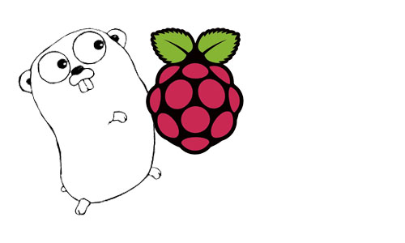
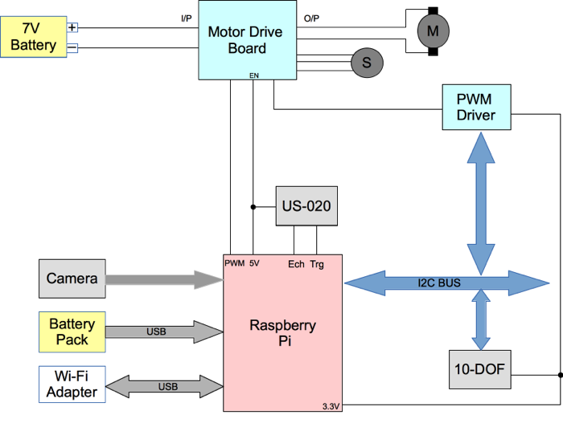

# thebot

## Introduction

The idea is to build a *open hardware* + *open source* robotic car platform

## Technologies

* RaspberryPi
* Golang

## Libraries used

* [go-rpi](https://github.com/kidoman/embd)
* [Martini](https://github.com/codegangsta/martini)

Complete [graph](http://godoc.org/github.com/thebot/thebot/src/firmware?import-graph) here.

## Schematic

## The video

